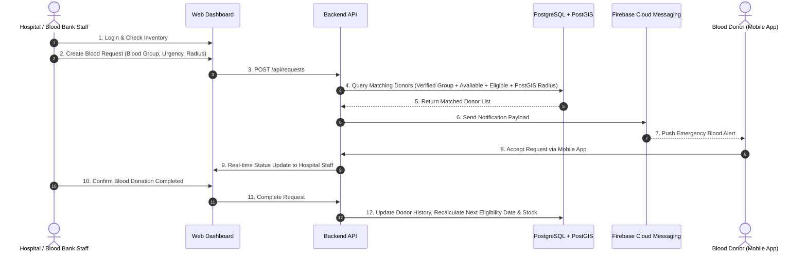

# BloodLink - Comprehensive Project Technical Reference

> **Project Name**: BloodLink - Smart Blood Donation Coordination System  
> **Academic Context**: SE5104 Mini Project | Department of Software Engineering, Faculty of Computing, Sabaragamuwa University of Sri Lanka  
> **Document Purpose**: Complete technical reference compiled from the official Project Proposal for development, architecture lookup, and team reference.

---

## 1. Executive Summary & Project Aim

**BloodLink** is a centralized, smart blood donation management and donor coordination platform designed to bridge the communication gap between healthcare institutions (hospitals and blood banks) and eligible blood donors in Sri Lanka.

### Core Aim
To replace manual, slow, and non-targeted communication methods (e.g. general social media posts, phone trees) with an automated, intelligent platform that matches institutional blood requirements with eligible nearby donors based on:
1. **Verified Blood Group Compatibility**
2. **Medical Donation Eligibility Intervals** (e.g. 3-month gap since last donation)
3. **Real-time Donor Availability Status**
4. **Geospatial Proximity Radius** (using PostGIS spatial queries)

---

## 2. Problem Definition & Gap Analysis

### Current Challenges in Blood Donation
* **Informal Broadcasting**: Hospitals currently rely on phone calls, social media posts, and messaging groups during shortages. These reach unspecified audiences, including ineligible donors or individuals living far away.
* **Unverified Donor Information**: Self-reported blood groups can be unreliable. Without document verification, inappropriate notifications can be generated.
* **Dynamic Availability & Eligibility**: Donors may be unavailable or medically ineligible due to recent donations. Static directories fail to filter these out, leading to notification fatigue.
* **Geospatial Delay**: Urgent emergency cases require finding donors within a specific driving/travel radius quickly.

### Gap Analysis Matrix

| Existing Solution | Strengths | Identified Limitations / Gaps | BloodLink Solution |
| :--- | :--- | :--- | :--- |
| **NBTS Digital Services** (BBMS, Raktha) | Stock monitoring, appointment booking, campaign info. | Distributed across separate tools; lacks real-time emergency donor coordination. | Unified platform combining stock management with real-time targeted donor matching. |
| **Friends2Support.org** | Donor directory & location search. | Peer-to-peer focused; lacks institutional request verification & stock tracking. | Institution-controlled request creation & verified donor coordination. |
| **BloodMe** | Urgent requests & donor notifications. | Lacks administrative verification, stock level tracking, and strict eligibility interval calculation. | Formal hospital/admin verification, PostGIS distance matching, and automated eligibility tracking. |
| **Social Media & Messaging** | Rapid reach. | Untargeted, unverified, noisy, and inefficient. | Targeted FCM push notifications sent *only* to verified, eligible, nearby donors. |

---

## 3. System Architecture & Component Design

BloodLink adopts a **Centralized Client-Server Architecture** composed of five primary layers:

```
+------------------------------------+      +-----------------------------------------+
|        Donor Mobile App            |      |      Hospital & Admin Web Dashboard     |
|    (React Native + TypeScript)     |      |           (React + TypeScript)          |
+-----------------+------------------+      +--------------------+--------------------+
                  |                                              |
                  +-------------------+      +-------------------+
                                      |      |
                                      v      v
                        +----------------------------+
                        |     Backend REST API       |
                        | (Node.js + Express + TS)   |
                        +--------------+-------------+
                                       |
         +-----------------------------+-----------------------------+
         |                             |                             |
         v                             v                             v
+------------------+         +-------------------+         +--------------------+
| PostgreSQL/PostGIS|         | Firebase Cloud    |         | Google Maps        |
| (Database Layer) |         | Messaging (FCM)   |         | Platform (Maps)    |
+------------------+         +-------------------+         +--------------------+
```

### Component Details
1. **Donor Mobile Application** (`mobile-app/`): React Native + TypeScript (Expo). Serves blood donors with profile management, verification upload, availability toggles, request feed, donation history, and push notifications.
2. **Hospital & Admin Web Dashboard** (`web-dashboard/`): React + TypeScript. Dedicated management dashboard for authorized hospital/blood-bank staff to manage stock levels and create blood requests, and for admins to verify institutions and donor documents.
3. **Backend API** (`backend/`): Node.js + Express + TypeScript. Handles authentication (JWT + RBAC), business logic, smart donor matching, database operations, and notification orchestration.
4. **Database & Geospatial Layer** (`database/`): PostgreSQL extended with PostGIS. Stores relational data and performs efficient spatial queries (`ST_DWithin`, `ST_Distance`).
5. **Push Notifications**: Firebase Cloud Messaging (FCM) for real-time delivery to mobile devices.
6. **Mapping**: Google Maps Platform for displaying hospital locations and location selection.

---

## 4. Functional Requirements

### 4.1 Donor Management (Mobile App)
* **FR-D1**: Account creation and secure authentication.
* **FR-D2**: Profile management (personal information, contact details, coarse location).
* **FR-D3**: Upload official medical/blood group verification documents.
* **FR-D4**: View blood group verification status (`Pending`, `Approved`, `Rejected`).
* **FR-D5**: Toggle availability status (`Available` / `Unavailable`).
* **FR-D6**: View donation history log.
* **FR-D7**: Automatic calculation and display of next eligible donation date.
* **FR-D8**: Receive automated push reminders when eligible to donate again.

### 4.2 Hospital & Blood Bank Management (Web Dashboard)
* **FR-H1**: Registration and staff account authentication.
* **FR-H2**: Blood stock inventory management per blood group.
* **FR-H3**: Stock status categorization (`Normal`, `Low`, `Critical`).
* **FR-H4**: Creation of blood requests with urgency levels (`Normal`, `Urgent`, `Emergency`).
* **FR-H5**: View active requests and track real-time donor responses (Accept/Decline).

### 4.3 Smart Donor Matching Engine
* **FR-M1**: Match donors using **Verified Blood Group** compatibility.
* **FR-M2**: Enforce **Donation Eligibility** check (must satisfy mandatory time interval since last donation).
* **FR-M3**: Check active **Donor Availability** status (`Available`).
* **FR-M4**: Execute **Geospatial Distance Query** (PostGIS radius query relative to hospital location).
* **FR-M5**: Dispatch real-time FCM notifications to matched donor cohort.
* **FR-M6**: Record donor response (`Accepted`, `Declined`, `No Response`).

### 4.4 Administration & Governance
* **FR-A1**: Administrative verification and approval of registered hospitals and blood banks.
* **FR-A2**: Document verification workflow for donor blood group submissions.
* **FR-A3**: User account management and Role-Based Access Control (RBAC).
* **FR-A4**: System activity monitoring and audit logging.

---

## 5. Core Operational Workflow



---

## 6. Database Entity-Relationship (ER) Structure

Primary data entities defined in the system architecture:

```
[Administrator] ---- Verifies ----> [Verification] <---- Uploads ---- [Donor]
       |                                                                |
   Manages                                                           Makes
       v                                                                v
   [Hospital] <---- Employs ---- [Staff]                           [Donation]
       |                           |                                    |
   Maintains                    Creates                             Updates
       v                           v                                    v
  [BloodStock]              [BloodRequest]                     [Next Eligibility]
                                   |
                               Generates
                                   v
                             [Notification] ---- Sent To ----> [Donor]
```

### Entity Overview
* **Donor**: `DonorID`, `FullName`, `NIC`, `BloodGroup`, `AvailabilityStatus`, `LocationGeometry`, `LastDonationDate`, `NextEligibleDate`.
* **Verification**: `VerificationID`, `DonorID`, `DocumentType`, `DocumentUrl`, `VerificationStatus`, `VerifiedByAdminID`, `VerificationDate`.
* **Hospital**: `HospitalID`, `HospitalName`, `Address`, `ContactPhone`, `LocationGeometry`, `IsApproved`.
* **Staff**: `StaffID`, `HospitalID`, `Name`, `Designation`, `Email`, `PasswordHash`, `Role`.
* **BloodStock**: `StockID`, `HospitalID`, `BloodGroup`, `AvailableUnits`, `Status` (`Normal`/`Low`/`Critical`).
* **BloodRequest**: `RequestID`, `HospitalID`, `BloodGroup`, `RequiredUnits`, `Priority` (`Normal`/`Urgent`/`Emergency`), `RadiusKm`, `Status`.
* **Notification**: `NotificationID`, `RequestID`, `DonorID`, `Title`, `Message`, `SentDate`, `ResponseStatus`.
* **Donation**: `DonationID`, `DonorID`, `HospitalID`, `DonationDate`, `UnitsDonated`.

---

## 7. Security, Privacy & Ethics (PDPA Compliance)

The platform handles personal health and location data, subject to **Sri Lanka's Personal Data Protection Act (PDPA) No. 9 of 2022**:

1. **Data Minimization & Purpose Limitation**:
   * Collect only operational data necessary for donor matching.
   * Exclude extensive medical histories from project scope.
2. **Location Privacy**:
   * Exact donor GPS coordinates are **never publicly displayed** or exposed to hospitals/other donors.
   * Spatial matching is executed server-side using PostGIS queries or coarse location boundaries.
3. **Authentication & Access Control**:
   * JWT-based REST API authentication with short-lived access tokens.
   * Role-Based Access Control (RBAC): Strict separation of Donor, Hospital Staff, and Admin privileges.
   * Passwords hashed using modern adaptive algorithms (bcrypt/Argon2).
   * Sensitive tokens excluded from web browser `localStorage` to mitigate XSS risks.
4. **Data Protection & Secure Storage**:
   * Mandatory HTTPS/TLS for all API communications.
   * Verification document files stored behind authenticated, authorized endpoints (no public bucket URLs).
   * Parameterized SQL queries via ORM to prevent SQL Injection.
   * No hardcoded API keys or secrets in source code; managed via `.env` files.

---

## 8. System Scope & Limitations

### In-Scope Features
* Cross-platform Mobile App for Donors.
* Web Dashboard for Hospitals & Blood Banks.
* Admin Panel for Organization and Document Verification.
* Smart PostGIS Matching Logic & FCM Notifications.
* Blood Group Verification Workflow.
* Donation History & Eligibility Reminder Engine.

### Out-of-Scope (Explicitly Excluded)
* Integration with national Electronic Health Record (EHR) systems.
* Direct integration with laboratory information devices for automated blood testing.
* Hospital appointment booking systems.
* Logistics and blood transport dispatch.
* Financial transactions / donor compensation.
* Predictive AI/ML demand forecasting (deliberately excluded to ensure focus on core coordination engine).

---

## 9. Modular Responsibilities Overview

| Project Component | Technical Focus | Core Deliverables |
| :--- | :--- | :--- |
| **Donor Mobile App & Coordination UI** | React Native + TypeScript (Expo) | Registration, donor profile, availability controls, request feed, donation history, mobile UI testing. |
| **Hospital/Blood-Bank Dashboard** | React + TypeScript | Blood stock status interface, request creation & urgency management, hospital staff workflow. |
| **Donor Matching & Notification Engine** | Node.js + Express + PostGIS + FCM | Geospatial matching algorithms, eligibility interval logic, FCM push notification dispatch, performance testing. |
| **Administration, Verification & Security** | Node.js + Express + React | Hospital/staff verification, donor document review workflow, RBAC, audit logging, security testing. |

---

## 10. Development & Testing Strategy

* **Unit Testing**: Testing individual matching logic functions, eligibility date calculations, and radius formulas using Jest.
* **Integration Testing**: Testing REST API endpoints, PostGIS spatial queries, and FCM notification queue dispatch.
* **System Testing**: End-to-end testing of emergency blood request creation -> donor notification -> response workflow.
* **Security Testing**: Verification of RBAC permissions, token handling, input validation, and OWASP compliance.
* **Device Testing**: Testing mobile app performance, notification permissions, and foreground/background behavior on Android devices.
